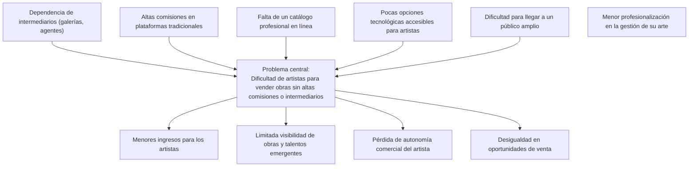

# Especificaciones de requisitos de sofware

**Proyecto: Desarrollo de pagina web en la que ayuda a los artista apublicar y vender su arte**

## Fecha del documento
| Fecha  | Version  | Autor  | Verificacion  | Observacines  |
|---|---|---|---|---|
|   |   |   |   |   |
|   |   |   |   |   |
|   |   |   |   |   |
## Contenido 

## 1 Introduccion

Todo: Redactar un parrafo donde se introduccione este documento

### 1.1 Proposito

Este Documento ayuda a que los artistas sean ma reconocido he implementar erramientas para vender su arte mas facilmente

### 1.2 Alcance

### 1.3 Persona involucrada 

| Nombre                 | Daniel Avila                                                   |
|------------------------|----------------------------------------------------------------|
| Rol                    | Back end                                                       |
| Categoría Profesional  | Estudiante de Ing de sistemas                                  |
| Responsdabilidad       | Diseñar, Elaborar el desarrollo e implemantacion en la pagina  |
| Inf Del Contacto       | dsavila@ucompensar.edu.co                                      |

### 1.4

| Nombre  | Descripción                                          |
|---------|------------------------------------------------------|
| Usuario | Persona que usará el sistema para gestionar procesos |
| ERS     | Especificación de Requisitos Software                |
| RF      | Requerimiento Funcional                              |
| RNF     | Requerimiento No Funcional                           |

### 1.5
### 1.6
### Diagrama Contexto

