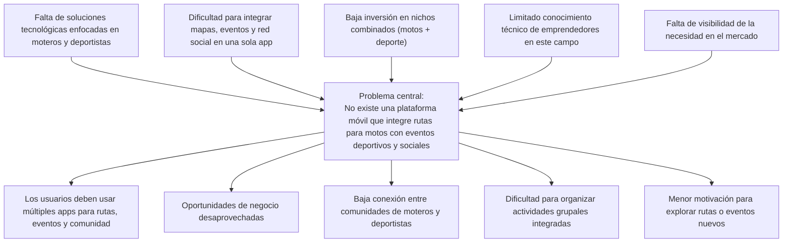

# Especificaciones de requisitos de sofware

**Proyecto:Una plataforma móvil que combine rutas personalizadas para motos con eventos relacionados a entrenamientos al aire libre y reuniones sociales en distintos lugares**

## Fecha del documento
| Fecha  | Version  | Autor  | Verificacion  | Observacines  |
|---|---|---|---|---|
|   |   |   |   |   |
|   |   |   |   |   |
|   |   |   |   |   |
## Contenido 

## 1 Introduccion

Todo: Redactar un parrafo donde se introduccione este documento

### 1.1 Proposito

Este Documento ayuda a que los conductores llegen facilmente a su destino

### 1.2 Alcance

### 1.3 Persona involucrada 

| Nombre                 | Nicolas Garcia                                                 |
|------------------------|----------------------------------------------------------------|
| Rol                    | Front end                                                       |
| Categoría Profesional  | Estudiante de Ing de sistemas                                  |
| Responsdabilidad       | Diseñar |
| Inf Del Contacto       | nicolasgarcia@ucompensar.edu.co                                      |

### 1.4

| Nombre  | Descripción                                          |
|---------|------------------------------------------------------|
| Usuario | Persona que usará el sistema para gestionar procesos |
| ERS     | Especificación de Requisitos Software                |
| RF      | Requerimiento Funcional                              |
| RNF     | Requerimiento No Funcional                           |

### 1.5
### 1.6
### Diagrama Contexto

