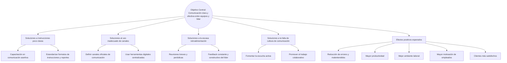

# prototipo_01
## Nicolas Garcia Bustos
problematica :En la empresa estamos teniendo problemas de comunicación y organización que afectan el desempeño. ¿Cuáles crees que son las causas principales de estos problemas y qué consecuencias están generando?.

# Arbol de problemas

# Promp

quiero que me ayude a crear 3 ideas de negocio que puedas implementar como ingeniero de sistemas, el negocio ba dirigido apersonas que tienen moto quiero que me digas que problemas resuelves y como es la dinamicas.

# soluciones tecnologicas 
1. App de Rutas y Eventos para Moteros y Deportistas

Una plataforma móvil que combine rutas personalizadas para motos con eventos relacionados a entrenamientos al aire libre y reuniones sociales en distintos lugares. La app podría ofrecer:

Mapas con rutas para motos, puntos de interés para entrenar (parques, gimnasios al aire libre).

Calendario de eventos sociales y deportivos en la ciudad o región.

Comunidad para que usuarios compartan experiencias, fotos y recomendaciones.
El ingeniero de sistemas se encarga del desarrollo, backend y la integración de datos en tiempo real.

2. Plataforma Streaming + Comunidad para Aficionados al Cine y Deportes

Un servicio que combine el streaming de películas relacionadas con deportes y motos, junto con una comunidad para organizar salidas a lugares (cine, gimnasios, rutas en moto). Algunas características:

Recomendaciones personalizadas basadas en gustos.

Organización de eventos para ver películas en grupo o salir a entrenar.

Foros y chats para compartir experiencias y tips.
El ingeniero de sistemas diseña la arquitectura del sistema y optimiza la experiencia de usuario.

3. Servicio de Entrenamiento Virtual para Moteros y Deportistas

Una plataforma que ofrece programas de entrenamiento personalizados para moteros (físicos y mentales) y deportistas, con realidad aumentada o seguimiento en tiempo real. También incluye rutas virtuales para motos.

Entrenamientos físicos y de manejo para mejorar habilidades y seguridad.

Integración con dispositivos wearables para monitoreo.

Simulaciones virtuales de rutas y desafíos.

El ingeniero de sistemas desarrolla el software y la integración con hardware.

# opcion elegida 

1. App de Rutas y Eventos para Moteros y Deportistas

Una plataforma móvil que combine rutas personalizadas para motos con eventos relacionados a entrenamientos al aire libre y reuniones sociales en distintos lugares. La app podría ofrecer:

Mapas con rutas para motos, puntos de interés para entrenar (parques, gimnasios al aire libre).

Calendario de eventos sociales y deportivos en la ciudad o región.

Comunidad para que usuarios compartan experiencias, fotos y recomendaciones.
El ingeniero de sistemas se encarga del desarrollo, backend y la integración de datos en tiempo real.
